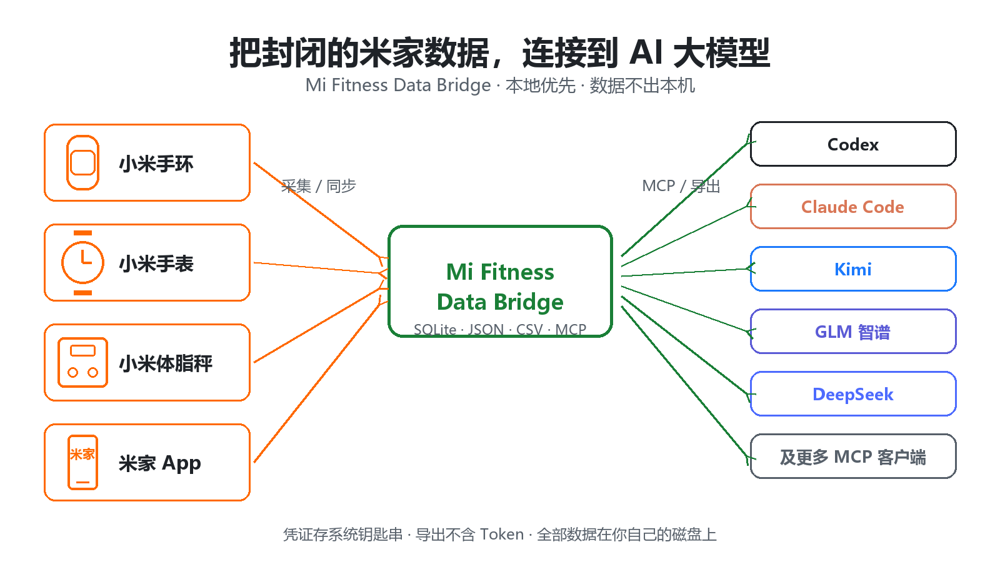
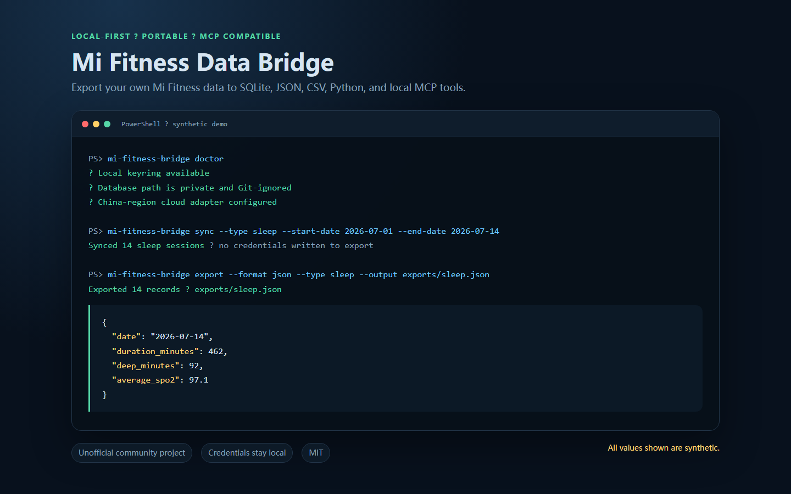

> English version: [README.en.md](README.en.md)

# Mi Fitness Data Bridge

本地优先的数据桥接器，把**你自己的**小米运动健康数据导出到 SQLite、JSON、CSV、Python 以及兼容 MCP 的工具。

*小米运动健康 App 很乐意给你看你的步数、睡眠和心率——却从不让你把这些数据带走。这个桥接器把你自己的数据放进你自己硬盘上的一个 SQLite 文件里。*

<p align="center"></p>

> 非官方社区项目。本项目与小米没有任何隶属或背书关系。实验性的云端适配器可能因为小米改动私有接口而随时失效。请只在你有权访问的账号和数据上使用。

## 合成数据演示



*上图中的所有健康数值都是合成数据，不包含任何凭据、账号标识或个人导出内容。*

## 实测验证

2026-07-20 在 Windows（Python 3.14）上基于 `main` 分支的提交录制。所有数据均为合成数据，不涉及任何凭据或网络访问。（测试数量已于 2026-07-29 复核更新。）

测试套件：

```text
$ python -m pytest -q -p no:cacheprovider
...................                                                      [100%]
19 passed in 6.43s
```

端到端合成演示（`examples/synthetic_demo.py` 先用合成记录填充本地 SQLite 缓存，再跑真实的 JSON/CSV 导出流水线）：

```text
$ python examples/synthetic_demo.py
Seeded synthetic database: C:\Users\njshk\AppData\Local\Temp\mi-fitness-demo-53el7cfh\mi_fitness.db
  daily_activity: 2026-07-15 .. 2026-07-15 (1 day(s))
  sleep: 2026-07-14 .. 2026-07-14 (1 day(s))
  workouts: 2026-07-15 .. 2026-07-15 (1 day(s))
  body_measurements: 2026-07-15 .. 2026-07-15 (1 day(s))

Export completed
  mi_fitness.json
  daily_activity.csv
  sleep.csv
  workouts.csv
  body_measurements.csv
  heart_rate.csv
  spo2.csv
  stress.csv
  abnormal_heart_beat.csv

JSON envelope:
  schema_version: 1.0
  source: mi_fitness_data_bridge
  records.daily_activity: 1 row(s)
  records.sleep: 1 row(s)
  records.workouts: 1 row(s)
  records.body_measurements: 1 row(s)

Sample sleep row (synthetic):
  start_at=2026-07-14T23:20:00 end_at=2026-07-15T07:05:00
  duration_minutes=465 score=86
  stages=[{"stage": "deep", "minutes": 82}, {"stage": "light", "minutes": 271}, {"stage": "rem", "minutes": 88}, {"stage": "awake", "minutes": 24}]
```

## 已合并 health-assistant 项目

`health-assistant` 项目（本地优先的个人健康看板：Strava、睡眠、身体成分、饮食分析）已合并进本仓库，其原仓库已归档。吸收过来的资产位于 `docs/health-assistant/` 目录下：

- `analytics.py` —— 零依赖的训练/恢复总结与建议引擎参考实现（7 天训练统计、急性/慢性负荷比、就绪度检查、每日训练建议）。
- `coaching_methodology.md` —— 其背后可解释的骑行教练、身体成分与运动营养方法论。
- `README.md` —— 完整的迁移说明，包括有意未移植的部分（FastAPI 看板、Strava OAuth/Webhook 管线、餐食照片分析）以及原因。

## 这个项目做什么

- 通过一个实验性的中国区云端适配器读取小米运动健康数据。
- 把规范化后的记录存进本地 SQLite 数据库。
- 导出不含凭据的便携式 JSON 或 CSV。
- 暴露本地 MCP 查询工具，供个人自动化使用。
- 为下游项目（比如个人减脂顾问）提供一份可复用的连接器实现。

它刻意**不**提供医疗建议、减肥指导、托管式账号访问或多用户云服务。

## 为什么做这个桥接器？

| 之前 | 之后 |
|---|---|
| 你的健康历史只存在于小米运动健康 App 里，唯一的"导出"方式是截图。 | `mi-fitness-bridge sync` 把每日活动、睡眠、运动、身体测量、心率、血氧（SpO2）和压力拉进一个规范化的本地 SQLite 数据库。 |
| 想回答"我上个月睡得怎么样"，得在 App 里一天天往回翻。 | `mi-fitness-bridge export --format csv --type sleep --start-date ... --end-date ...` 输出一个精确按该区间过滤、可直接用表格软件打开的 CSV。 |
| 想让 AI 助手访问你的健康数据，就得把凭据交给某个托管服务。 | `mi-fitness-bridge serve` 基于你自己的数据库暴露本地 MCP 查询工具；passToken 留在操作系统钥匙串里，导出文件中永远不会包含它。 |

## 支持的数据集

- 每日活动：步数、距离、活动热量和活动分钟数。
- 睡眠记录及睡眠阶段。
- 运动记录。
- 身体测量：体重及可用的身体成分字段。
- 心率样本，包括可用时的静息心率。
- 血氧（SpO2）、压力和异常心跳事件（取决于账号/设备是否提供）。

实际可用性因设备、账号地区、固件和小米上游服务而异。

## 安装

```bash
git clone https://github.com/shkyyy18/mi-fitness-data-bridge.git mi_fitness_data_bridge
cd mi_fitness_data_bridge
python -m venv .venv
```

Windows PowerShell：

```powershell
.\.venv\Scripts\Activate.ps1
pip install -e ".[dev]"
```

macOS/Linux：

```bash
source .venv/bin/activate
pip install -e '.[dev]'
```

## 配置

更安全的交互式配置路径可以避免把 passToken 直接写进 shell 历史：

```bash
mi-fitness-bridge setup
mi-fitness-bridge doctor
```

在可用时，凭据通过本地钥匙串（keyring）存储。某些备用的 keyring 实现存储密钥的方式可能不够安全，使用前请先了解你操作系统的 keyring 行为。

## 同步

```bash
mi-fitness-bridge sync --start-date 2026-07-01 --end-date 2026-07-15
```

或者只同步某一个数据集：

```bash
mi-fitness-bridge sync --type sleep --start-date 2026-07-01 --end-date 2026-07-15
mi-fitness-bridge sync --type body_measurements --start-date 2026-07-01 --end-date 2026-07-15
```

## 导出

生成一个便携式 JSON 文件：

```bash
mi-fitness-bridge export --format json --output exports/mi_fitness.json
```

每个数据集各生成一个 CSV 文件：

```bash
mi-fitness-bridge export --format csv --output exports/csv
```

按数据集和日期过滤：

```bash
mi-fitness-bridge export --format json --type sleep \
  --start-date 2026-07-01 --end-date 2026-07-15 \
  --output exports/sleep.json
```

导出文件永远不会包含已保存的小米 passToken。导出的健康记录仍然是敏感的个人数据，默认已被 Git 忽略。

## MCP 服务

兼容命令仍然可用：

```bash
mi-fitness-bridge serve
# legacy alias
mi-fitness-mcp serve
```

可用的工具包括连接状态、同步、覆盖范围、每日摘要、身体测量、睡眠、运动、心率、血氧（SpO2）和压力查询。

## 作为 Python 依赖使用

规范化适配器在兼容模块名下仍然可用：

```python
from mi_fitness_mcp.adapters.mi_fitness_cloud import MiFitnessCloudAdapter
```

下游项目应当安装本包，而不是 vendor 或复制连接器源码。

## 隐私与安全

- 妥善保管 passToken、本地数据库、导出文件和日志，不要外泄。
- 不要把本桥接器当作公开的凭据代理来运行。
- 不要提交真实健康数据或包含个人指标的截图。
- 在 bug 报告和文档中一律使用合成数据。
- 本软件仅用于个人数据访问和工程研究，不用于诊断或治疗。

负责任披露方式见 `SECURITY.md`，出处溯源见 `THIRD_PARTY_NOTICES.md`。

## 开发

```bash
pip install -e '.[dev]'
python -m pytest -q -p no:cacheprovider
python -m ruff check src tests
```

## 发布

版本历史见 `CHANGELOG.md`，发布及发布后检查项见 `docs/release-checklist.md`。

## 目前的进展

这是一个年轻的单人维护项目，我们宁可展示真实数字，也不愿粉饰：

- **Star 数：** 1 —— 目前维护者整个 GitHub 账号上唯一的一颗 star，就在这个仓库上。如果这个桥接器对你有用，你的一颗 star 真的会很显眼。
- **流量（GitHub insights，截至 2026-07-25 的 14 天）：** 36 个独立克隆者，2 个独立访客。
- **外部贡献：** 暂无 —— 还没有收到外部的 pull request 或 issue。队列是开放的、经过筛选的，见 [good first issues](https://github.com/shkyyy18/mi-fitness-data-bridge/issues?q=is%3Aissue+is%3Aopen+label%3A%22good+first+issue%22)。
- **测试套件：** 本地 19 个测试全部通过（`python -m pytest -q -p no:cacheprovider`），2026-07-28 在 Windows 上用 Python 3.14 验证。

维护者的姊妹项目 [AgentCron](https://github.com/shkyyy18/cc-autopilot) 正是通过同样的 good-first-issue 队列收到了它的前三个外部 pull request；[首次贡献案例分析](https://github.com/shkyyy18/cc-autopilot/blob/main/docs/first-contribution-case-study.md)记录了是什么让这些任务容易上手。这里采用了相同的设计：范围小、验收标准白纸黑字、用合成数据即可离线验证、全程不需要真实健康数据。

## 支持这个项目

如果这个桥接器终于让你能用自己的小米运动健康数据做点什么——一张图表、一份备份、一次 MCP 驱动的查询——在 [GitHub](https://github.com/shkyyy18/mi-fitness-data-bridge) 上点一颗 star，能帮下一个想拿回自己数据的人找到它。如果你有十分钟，挑一个 good first issue 是让这个桥接器变得更好的最快方式。

## 许可证

MIT。见 `LICENSE`。上游署名保留在 `THIRD_PARTY_NOTICES.md` 中。
